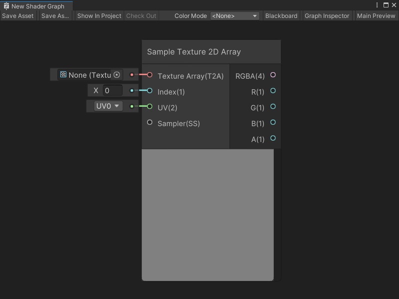
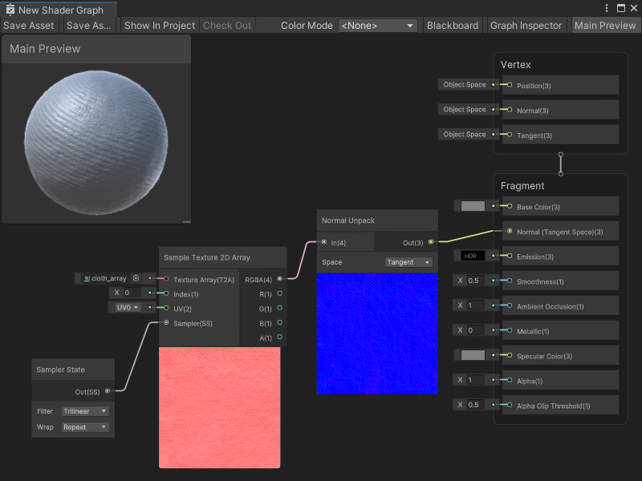

Sample Texture 2D Array 节点
==========================

描述
--

**Sample Texture 2D Array 节点**用于采样**2D 纹理数组**资源，并返回 **Vector 4** 颜色值。您可以为纹理采样指定**UV**坐标，并使用[采样器状态节点](Sampler-State-Node.md)来定义特定的采样器状态。节点的**索引**输入端口指定要采样的纹理 2D 数组的索引。

有关 Texture 2D Arrays 的更多信息，请参阅团结引擎用户手册中的[纹理数组](https://docs.unity.cn/cn/tuanjiemanual/Manual/class-Texture2DArray.html)。

> [!NOTE]
> 如果在包含自定义函数节点或子图形的图形中使用此节点时遇到纹理采样错误，可以通过升级到 10\.3 或更高版本来解决这些问题。



[](#create-node-menu-category) 创建节点菜单类别
-------------------------------------------------------

Sample Texture 2D Array 节点位于创建节点菜单（Create Node Menu）的 **Input -> Texture** 分类下。

[](#compatibility) 兼容性
-------------------------------

Sample Texture 2D 节点支持以下渲染管线：

| **内置渲染管线** | **通用渲染管线 (URP)** | **高清渲染管线 (HDRP)** |
| --- | --- | --- |
| 是 | 是 | 是 |

默认设置下，此节点只能连接到 Shader Graph 的**片段**上下文中的块节点。要在 Shader Graph 的**顶点**上下文中采样纹理，请将 [Mip 采样模式](#additional-node-settings)（Mip Sampling Mode） 设置为 **LOD**。


输入
-----------------

采样 3D 纹理节点具有以下输入端口：

| **名称** | **类型** | **绑定** | **描述** |
| --- | --- | --- | --- |
| **Texture Array** | Texture 2D Array	 | 无 | 要采样的 2D 纹理数组资源。 |
| **Index** | Float | 无 | 要采样的纹理数组中的特定纹理的索引。索引值表示纹理在纹理数组中的位置。数组中的索引值始终从 0 开始。一个包含四个纹理的数组会有位置 0、1、2 和 3。 |
| **UV** | Vector 2 | 无 | 用于采样纹理的 UV 坐标。 |
| **Sampler** | Sampler State | 默认采样器状态 | 用于采样纹理的采样器状态和设置。 |
| **LOD** | Float | LOD | **注意**：只有当**Mip 采样模式**（Mip Sampling Mode）设置为**LOD**时，**LOD** 输入端口才会显示。有关更多信息，请参阅[其他节点设置](#additional-node-settings)。采样纹理时使用的具体 mip 级别。 |
| **Bias** | Float | Bias | **注意**：只有当**Mip 采样模式**（Mip Sampling Mode）设置为 **Bias** 时，**Bias** 输入端口才会显示。有关更多信息，请参阅[其他节点设置](#additional-node-settings)。如果启用了 **Use Global Mip Bias**，会将此偏差值添加到纹理的 mip 计算中的全局 mip 偏差。如果禁用全局 mip 偏差，将使用此偏差值而不是全局 mip 偏差。 |
| **DDX** | Float | DDY | **注意**：只有当**Mip 采样模式**（Mip Sampling Mode）设置为 **Gradient** 时，**DDX** 输入端口才会显示。有关更多信息，请参阅[其他节点设置](#additional-node-settings)。用于计算纹理的 mip 时使用的特定 DDX 值。有关 mipmap 的 DDX 值的更多信息，请参阅用户手册中的[Mipmaps 介绍](https://docs.unity.cn/cn/tuanjiemanual/Manual/texture-mipmaps-introduction.html)。 |
| **DDY** | Float | DDY | **注意**：只有当**Mip 采样模式**（Mip Sampling Mode）设置为 **Gradient** 时，**DDY** 输入端口才会显示。有关更多信息，请参阅[其他节点设置](#additional-node-settings)。用于计算纹理的 mip 时使用的特定 DDY 值。有关 mipmap 的 DDY 值的更多信息，请参阅用户手册中的[Mipmaps 介绍](https://docs.unity.cn/cn/tuanjiemanual/Manual/texture-mipmaps-introduction.html)。 |

## 其他节点设置 <a name="additional-node-settings"></a>

Sample Texture 2D 节点的图表检查器中可访问以下其他设置：

<table>
<thead>
<tr>
<th><strong>名称</strong></th>
<th><strong>类型</strong></th>
<th colspan="2"><strong>描述</strong></th>
</tr>
</thead>
<tbody>
<tr>
<td rowspan="3"><strong>Use Global Mip Bias</strong></td>
<td rowspan="3">切换</td>
<td colspan="2">启用 <strong>Use Global Mip Bias</strong> 以使用渲染管线的全局 Mip 偏差。此偏差在采样时调整从特定 mip 级别获取的纹理信息比例。有关 mip 偏差的更多信息，请参见团结引擎用户手册中的<a href="https://docs.unity.cn/cn/tuanjiemanual/Manual/texture-mipmaps-introduction.html"> Mipmaps 介绍</a>。</td>
</tr>
<tr>
<td><strong>Enabled</strong></td>
<td>Shader Graph 使用渲染管线的全局 Mip 偏差来调整采样时获取的纹理信息。</td>
</tr>
<tr>
<td><strong>Disabled</strong></td>
<td> Shader Graph 不使用渲染管线的全局 Mip 偏差来调整采样时的纹理信息。</td>
</tr>
<tr>
<td rowspan="5"><strong>Mip Sampling Mode</strong></td>
<td rowspan="5">下拉菜单</td>
<td colspan="2">选择用于计算纹理 mip 级别的采样模式。</td>
</tr>
<tr>
<td><strong>Standard</strong></td>
<td>渲染管线自动计算并选择纹理的 mip。</td>
</tr>
<tr>
<td><strong>LOD</strong></td>
<td>渲染管线允许你在节点上为纹理设置明确的 mip。无论像素间的 DDX 或 DDY 计算如何，纹理始终使用该 mip。将 Mip 采样模式设置为 <strong>LOD</strong>，以将节点连接到顶点上下文中的 Block 节点。有关 Block 节点和上下文的更多信息，请参见  <a href="Master-Stack.md">Master Stack</a>。</td>
</tr>
<tr>
<td><strong>Gradient</strong></td>
<td>渲染管线允许你设置用于 mip 计算的 DDX 和 DDY 值，而不是使用从纹理的 UV 坐标计算的值。有关 DDX 和 DDY 值的更多信息，请参见团结引擎用户手册中的<a href="https://docs.unity.cn/cn/tuanjiemanual/Manual/texture-mipmaps-introduction.html"> Mipmaps 介绍</a>。</td>
</tr>
<tr>
<td><strong>Bias</strong></td>
<td>渲染管线允许你设置一个偏差来向上或向下调整纹理的计算 mip。负值将偏向更高分辨率的 mip。正值将偏向更低分辨率的 mip。渲染管线可以将该值添加到全局 Mip 偏差的值中，或直接使用此值代替全局 Mip 偏差。有关 mip 偏差的更多信息，请参见团结引擎用户手册中的<a href="https://docs.unity.cn/cn/tuanjiemanual/Manual/texture-mipmaps-introduction.html"> Mipmaps 介绍</a>。</td>
</tr>
</tbody>
</table>


输出
-------------------

采样 3D 纹理节点具有以下输出端口：

| **名称** | **类型** | **描述** |
| --- | --- | --- |
| **RGBA** | Vector 4 | 纹理样本的完整 RGBA Vector 4 颜色值。 |
| **R** | Float | 纹理样本的红色 (x) 分量。 |
| **G** | Float | 纹理样本的绿色 (y) 分量。 |
| **B** | Float | 纹理样本的蓝色 (z) 分量。 |
| **A** | Float | 纹理样本的透明度Alpha (w) 分量。 |

示例图形用法
--------------------------------------

在以下示例中，Sample Texture 2D Array 节点采样一个包含四种不同布料法线贴图的纹理数组。更改传递给**索引**端口的数字，Sample Texture 2D Array 节点就可以从数组中采样特定的法线贴图。**索引**值会改变节点传递给法线解包（Normal Unpack）节点和主栈中的法线（切线空间）块节点的输出。




[](#generated-code-example) 生成代码示例
-------------------------------------------------

以下代码展示了着色器代码中此节点的实现：
```
float4 _SampleTexture2DArray_RGBA = SAMPLE_TEXTURE2D_ARRAY(Texture, Sampler, UV, Index);
float _SampleTexture2DArray_R = _SampleTexture2DArray_RGBA.r;
float _SampleTexture2DArray_G = _SampleTexture2DArray_RGBA.g;
float _SampleTexture2DArray_B = _SampleTexture2DArray_RGBA.b;
float _SampleTexture2DArray_A = _SampleTexture2DArray_RGBA.a;

```

[](#related-nodes)相关节点
-------------------------------

以下节点与 Sample Texture 2D Array 节点相关或类似：

*   [Sample Texture 2D 节点](Sample-Texture-2D-Node.md)
*   [Sample Texture 3D 节点](Sample-Texture-3D-Node.md)
*   [Sampler State 节点](Sampler-State-Node.md)