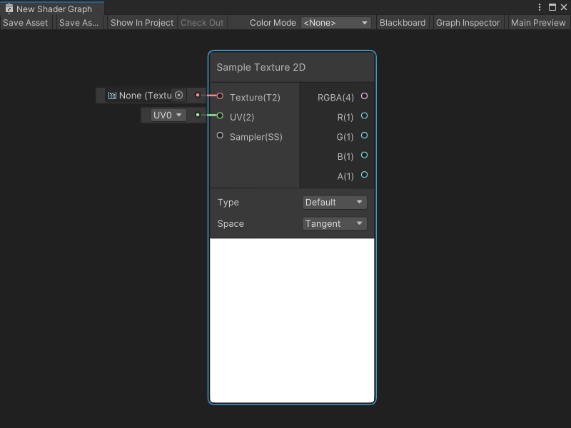
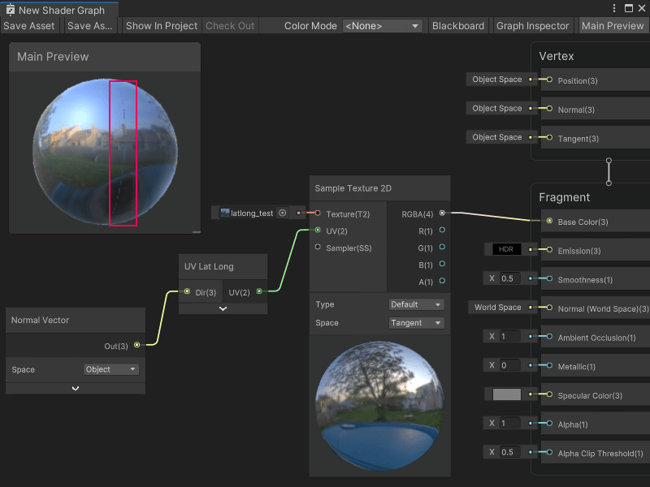
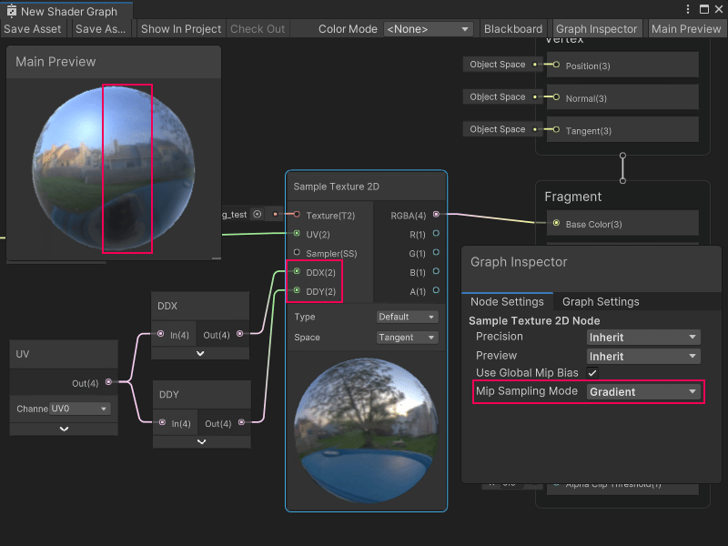

Sample Texture 2D 节点
======================

描述
-----

Sample Texture 2D 节点用于采样 **Texture 2D** 资源，并返回 **Vector 4** 的颜色值。用户可以指定纹理采样的 **UV** 坐标，并使用 [Sampler State 节点](Sampler-State-Node.md)定义特定的采样状态。

Sample Texture 2D 节点还可以采样法线贴图。更多信息请参见[控件](#controls)部分或团结引擎用户手册中的[法线贴图（凹凸映射）](https://docs.unity.cn/cn/tuanjiemanual/Manual/StandardShaderMaterialParameterNormalMap.html)。

> [!NOTE]
> 若在包含自定义函数节点或子图的图表中使用该节点出现纹理采样错误，建议升级至 Shader Graph 10.3 或更高版本。



[](#create-node-menu-category) 创建节点菜单类别
-------------------------------------------------------

Sample Texture 2D 节点位于创建节点菜单（Create Node Menu）的 **Input -> Texture** 分类下。

[](#compatibility) 兼容性
-------------------------------

Sample Texture 2D 节点支持以下渲染管线：

| **内置渲染管线** | **通用渲染管线 (URP)** | **高清渲染管线 (HDRP)** |
| --- | --- | --- |
| 是 | 是 | 是 |

默认设置下，此节点只能连接到 Shader Graph 的**片段**上下文中的块节点。要在 Shader Graph 的**顶点**上下文中采样纹理，请将 [Mip 采样模式](#additional-node-settings)（Mip Sampling Mode） 设置为 **LOD**。

[](#inputs) 输入
-----------------

Sample Texture 2D 节点具有以下输入端口：

| **名称** | **类型** | **绑定** | **描述** |
| --- | --- | --- | --- |
| **Texture** | Texture 2D | 无 | 要采样的 Texture 2D 资源。 |
| **UV** | Vector 2 | UV | 采样纹理时使用的 UV 坐标。 |
| **Sampler** | Sampler State | 默认采样器状态 | 使用的采样器状态及设置。 |
| **LOD** | Float | LOD | 采样纹理时使用的特定 mip。**注意**：仅当 **Mip 采样模式**为 **LOD** 时显示。详情请参阅[其他节点设置](#additional-node-settings)。 |
| **Bias** | Float | 偏移（Bias） | **注意**：仅当 **Mip 采样模式**为 **Bias** 时显示。如果启用了 **使用全局 Mip 偏移**（Use Global Mip Bias），会将此偏移量添加到全局 Mip 偏移。 |
| **DDX** | Float | DDY | **注意**：仅当 **Mip 采样模式**为 **Gradient** 时显示。详情请参阅[其他节点设置](#additional-node-settings)。 |
| **DDY** | Float | DDY | **注意**：仅当 **Mip 采样模式**为 **Gradient** 时显示。详情请参阅[其他节点设置](#additional-node-settings)。 |

## 控件 <a name="controls"></a>

Sample Texture 2D 节点具有以下控件：

<table>
<thead>
<tr>
<th><strong>名称</strong></th>
<th><strong>类型</strong></th>
<th colspan="2"><strong>描述</strong></th>
</tr>
</thead>
<tbody>
<tr>
<td rowspan="3"><strong>Type</strong></td>
<td rowspan="3">下拉菜单</td>
<td colspan="2">选择纹理类型是纹理资源或法线贴图。</td>
</tr>
<tr>
<td><strong>Default</strong></td>
<td>纹理类型为纹理资源。</td>
</tr>
<tr>
<td><strong>Normal</strong></td>
<td>纹理类型为法线贴图。</td>
</tr>
<tr>
<td rowspan="3"><strong>Space</strong></td>
<td rowspan="3">下拉菜单</td>
<td colspan="2"> 如果节点 <b>类型</b> 为 <b>法线</b>，请为法线贴图选择 Space。</td>
</tr>
<tr>
<td><strong>Tangent</strong></td>
<td>当几何体网格需要变形或更改（例如动画角色）时，使用切线法线贴图。使用 <strong>Tangent</strong> 空间时，法线贴图的法线相对于渲染在 Shader Graph 中的几何体的现有顶点法线。Shader Graph 只会调整顶点法线，而不会覆盖它们。</td>
</tr>
<tr>
<td><strong>Object</strong></td>
<td>当几何体网格是静态且不变形时，使用对象法线贴图。在 <strong>Object</strong> 空间中，法线贴图的法线是显式的，并覆盖渲染在 Shader Graph 中的几何体的法线。由于静态网格的法线不会改变，<strong>Object</strong> 法线贴图也能在不同的细节层级（LOD）中保持一致的光照效果。<br>有关法线贴图的更多信息，请参见用户手册中的 <a href="https://docs.unity.cn/cn/tuanjiemanual/Manual/StandardShaderMaterialParameterNormalMap.html" target="unity_manual">法线贴图（凹凸贴图）</a>。</td>
</tr>
</tbody>
</table>

## 其他节点设置 <a name="additional-node-settings"></a>

Sample Texture 2D 节点的图表检查器中可访问以下其他设置：

<table>
<thead>
<tr>
<th><strong>名称</strong></th>
<th><strong>类型</strong></th>
<th colspan="2"><strong>描述</strong></th>
</tr>
</thead>
<tbody>
<tr>
<td rowspan="3"><strong>Use Global Mip Bias</strong></td>
<td rowspan="3">切换</td>
<td colspan="2">启用 <strong>Use Global Mip Bias</strong> 以使用渲染管线的全局 Mip 偏差。此偏差在采样时调整从特定 mip 级别获取的纹理信息比例。有关 mip 偏差的更多信息，请参见团结引擎用户手册中的<a href="https://docs.unity.cn/cn/tuanjiemanual/Manual/texture-mipmaps-introduction.html"> Mipmaps 介绍</a>。</td>
</tr>
<tr>
<td><strong>Enabled</strong></td>
<td>Shader Graph 使用渲染管线的全局 Mip 偏差来调整采样时获取的纹理信息。</td>
</tr>
<tr>
<td><strong>Disabled</strong></td>
<td> Shader Graph 不使用渲染管线的全局 Mip 偏差来调整采样时的纹理信息。</td>
</tr>
<tr>
<td rowspan="5"><strong>Mip Sampling Mode</strong></td>
<td rowspan="5">下拉菜单</td>
<td colspan="2">选择用于计算纹理 mip 级别的采样模式。</td>
</tr>
<tr>
<td><strong>Standard</strong></td>
<td>渲染管线自动计算并选择纹理的 mip。</td>
</tr>
<tr>
<td><strong>LOD</strong></td>
<td>渲染管线允许你在节点上为纹理设置明确的 mip。无论像素间的 DDX 或 DDY 计算如何，纹理始终使用该 mip。将 Mip 采样模式设置为 <strong>LOD</strong>，以将节点连接到顶点上下文中的 Block 节点。有关 Block 节点和上下文的更多信息，请参见  <a href="Master-Stack">Master Stack</a>。</td>
</tr>
<tr>
<td><strong>Gradient</strong></td>
<td>渲染管线允许你设置用于 mip 计算的 DDX 和 DDY 值，而不是使用从纹理的 UV 坐标计算的值。有关 DDX 和 DDY 值的更多信息，请参见团结引擎用户手册中的<a href="https://docs.unity.cn/cn/tuanjiemanual/Manual/texture-mipmaps-introduction.html"> Mipmaps 介绍</a>。</td>
</tr>
<tr>
<td><strong>Bias</strong></td>
<td>渲染管线允许你设置一个偏差来向上或向下调整纹理的计算 mip。负值将偏向更高分辨率的 mip。正值将偏向更低分辨率的 mip。渲染管线可以将该值添加到全局 Mip 偏差的值中，或直接使用此值代替全局 Mip 偏差。有关 mip 偏差的更多信息，请参见团结引擎用户手册中的<a href="https://docs.unity.cn/cn/tuanjiemanual/Manual/texture-mipmaps-introduction.html"> Mipmaps 介绍</a>。</td>
</tr>
</tbody>
</table>

[](#outputs) 输出
-------------------

Sample Texture 2D 节点具有以下输出端口：

| **名称** | **类型** | **描述** |
| --- | --- | --- |
| **RGBA** | Vector 4 | 纹理样本的完整 RGBA Vector 4 颜色值。 |
| **R** | Float | 纹理样本的红色 (x) 分量。 |
| **G** | Float | 纹理样本的绿色 (y) 分量。 |
| **B** | Float | 纹理样本的蓝色 (z) 分量。 |
| **A** | Float | 纹理样本的透明度Alpha (w) 分量。 |

[](#example-graph-usage) 示例图表用法
-------------------------------------------

在以下示例中，Sample Texture 2D 节点使用了一个生成纬度和经度格式 UV 坐标的[子图节点](Sub-graph-Node.md)。这些纬度和经度 UV 坐标有助于渲染 **latlong_test** 2D 纹理资源，该资源使用纬度和经度投影创建和格式化。生成的纬度和经度 UV 坐标可以将 2D 纹理资源准确地映射到球形几何体上。

如果 Sample Texture 2D 节点使用**标准（Standard）** Mip 采样模式，纹理将在球体的侧面显示出一条接缝，这条接缝位于纹理的左右两侧交汇处。在模型上的接缝处，采样纹理的纬度和经度 UV 坐标从 0 跳至 1，这导致样本中的 mip 级别计算出现问题。mip 级别计算错误会导致该接缝的产生。要去除接缝，纹理需要使用不同的 mip 采样模式。



当 Mip 采样模式设置为 **Gradient** 时，Sample Texture 2D 节点可以在 mip 级别计算中使用模型的标准 UV 集，而不是采样纹理所需的纬度和经度 UV。传递到 **DDX** 和 **DDY** 输入端口的新 UV 坐标可产生连续的 mip 级别，从而去除接缝。



## 生成代码示例 <a name="generated-code-example"></a>

以下代码展示了着色器代码中此节点的实现：

### [](#default) 默认

```c
float4 _SampleTexture2D_RGBA = SAMPLE_TEXTURE2D(Texture, Sampler, UV);
float _SampleTexture2D_R = _SampleTexture2D_RGBA.r;
float _SampleTexture2D_G = _SampleTexture2D_RGBA.g;
float _SampleTexture2D_B = _SampleTexture2D_RGBA.b;
float _SampleTexture2D_A = _SampleTexture2D_RGBA.a;
```

### [](#normal) 法线

```c
float4 _SampleTexture2D_RGBA = SAMPLE_TEXTURE2D(Texture, Sampler, UV);
_SampleTexture2D_RGBA.rgb = UnpackNormalmapRGorAG(_SampleTexture2D_RGBA);
float _SampleTexture2D_R = _SampleTexture2D_RGBA.r;
float _SampleTexture2D_G = _SampleTexture2D_RGBA.g;
float _SampleTexture2D_B = _SampleTexture2D_RGBA.b;
float _SampleTexture2D_A = _SampleTexture2D_RGBA.a;
```

[](#related-nodes) 相关节点
-------------------------------

以下节点与 Sample Texture 2D 节点相关或类似：

* [Sample Texture 2D Array 节点](Sample-Texture-2D-Array-Node.md)
* [Sample Texture 3D 节点](Sample-Texture-3D-Node.md)
* [Sampler State 节点](Sampler-State-Node.md)