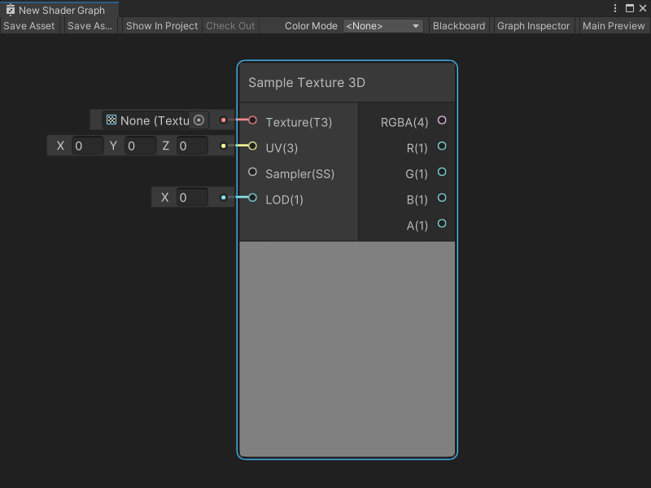
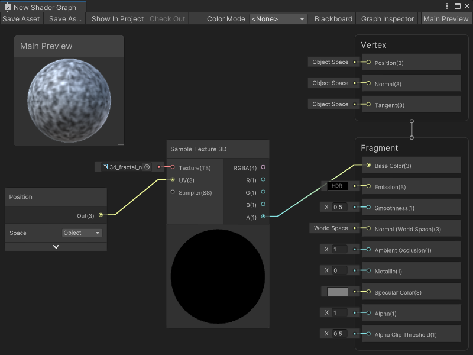

Sample Texture 3D 节点
====================


描述
--

Sample Texture 3D 节点用于采样**3D 纹理**资源，并返回一个 **Vector 4** 的颜色值。您可以指定纹理采样的 **UV** 坐标，并使用[采样器状态节点](Sampler-State-Node.md)来定义特定的采样器状态。

有关 3D 纹理资源的详细信息，请参阅团结引擎用户手册中的[3D 纹理](https://docs.unity.cn/cn/tuanjiemanual/Manual/class-Texture3D.html)。

> [!NOTE]
> 如果在包含自定义函数节点或子图的图形中遇到此节点的纹理采样错误，请升级到 Shader Graph 版本 10.3 或更高版本。



[](#create-node-menu-category)创建节点菜单类别
-------------------------------------------------------

采样 3D 纹理节点位于创建节点菜单的 **输入** > **纹理** 类别下。

[](#compatibility)兼容性
-------------------------------

采样 3D 纹理节点支持以下渲染管线：

| **内置渲染管线** | **通用渲染管线 (URP)** | **高清渲染管线 (HDRP)** |
| --- | --- | --- |
| 是 | 是 | 是 |

默认设置下，此节点只能连接到 Shader Graph 的**片段**上下文中的块节点。要在 Shader Graph 的**顶点**上下文中采样纹理，请将 [Mip 采样模式](#additional-node-settings)（Mip Sampling Mode） 设置为 **LOD**。

[](#inputs)输入
-----------------

采样 3D 纹理节点具有以下输入端口：

| **名称** | **类型** | **绑定** | **描述** |
| --- | --- | --- | --- |
| **Texture** | Texture 3D | 无 | 要采样的 3D 纹理资源。 |
| **UV** | Vector 3 | 无 | 用于采样纹理的 3D UV 坐标。 |
| **Sampler** | 采样器状态 | 默认采样器状态 | 用于采样纹理的采样器状态和设置。 |
| **LOD** | Float | LOD | 采样纹理时使用的特定 mip。**注意**：**LOD** 输入端口仅在 **Mip 采样模式**为 **LOD** 时显示。有关更多信息，请参见[其他节点设置](#additional-node-settings)。 |

## 其他节点设置 <a name="additional-node-settings"></a>

采样 3D 纹理节点有一些额外的设置，您可以从图形检查器（Graph Inspector）访问：


<table>
<thead>
<tr>
<th><strong>名称</strong></th>
<th><strong>类型</strong></th>
<th colspan="2"><strong>描述</strong></th>
</tr>
</thead>
<tbody>
<tr>
<td rowspan="5"><strong>Mip Sampling Mode</strong></td>
<td rowspan="5">下拉菜单</td>
<td colspan="2">选择采样 3D 纹理节点用于计算纹理 mip 级别的采样模式。</td>
</tr>
<tr>
<td><strong>Standard</strong></td>
<td>渲染管线自动计算并选择纹理的 mip。</td>
</tr>
<tr>
<td><strong>LOD</strong></td>
<td>渲染管线允许你在节点上为纹理设置明确的 mip。无论像素间的 DDX 或 DDY 计算如何，纹理始终使用该 mip。将 Mip 采样模式设置为 <strong>LOD</strong>，以将节点连接到顶点上下文中的 Block 节点。有关 Block 节点和上下文的更多信息，请参见  <a href="Master-Stack.md">Master Stack</a>。</td>
</tr>
</tbody>
</table>

[](#outputs)输出
-------------------

采样 3D 纹理节点具有以下输出端口：

| **名称** | **类型** | **描述** |
| --- | --- | --- |
| **RGBA** | Vector 4 | 纹理样本的完整 RGBA Vector 4 颜色值。 |
| **R** | Float | 纹理样本的红色 (x) 分量。 |
| **G** | Float | 纹理样本的绿色 (y) 分量。 |
| **B** | Float | 纹理样本的蓝色 (z) 分量。 |
| **A** | Float | 纹理样本的透明度Alpha (w) 分量。 |

[](#example-graph-usage)示例图形用法
-------------------------------------------

在以下示例中，Sample Texture 3D 节点采样了一个 3D 分形噪声纹理资源。它的输入 UV 坐标来自一个位置节点，设置为**对象（Object）** 空间。

Sample Texture 3D 节点需要 Vector 3 作为其 UV 坐标输入，而不是 Vector 2，因为纹理资源在虚拟的 3D 空间中作为一个体积存在。该节点使用默认的采样器状态，因为没有连接采样器状态节点。

这个特定的 3D 纹理资源将其纹理数据存储在 Alpha 通道中，因此 Sample Texture 3D 节点使用其 **A** 输出端口作为主栈**片元**上下文中基础颜色块（Base Color Block）节点的输入：



[](#generated-code-example)生成的代码示例
-------------------------------------------------

以下代码代表着色器代码中的此节点：

```
float4 _SampleTexture3D_Out = SAMPLE_TEXTURE3D(Texture, Sampler, UV);

```

[](#related-nodes)相关节点
-------------------------------

以下节点与采样 3D 纹理节点相关或类似：

*   [Sample Texture 2D Array节点](Sample-Texture-2D-Array-Node.md)
*   [Sample Texture 2D 节点](Sample-Texture-2D-Node.md)
*   [Sampler State 节点](Sampler-State-Node.md)
