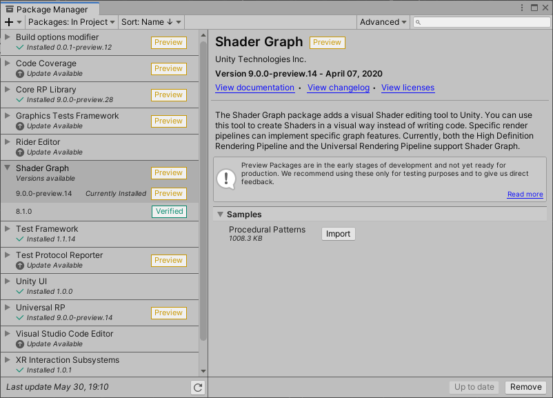
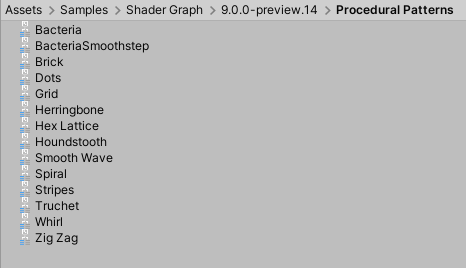
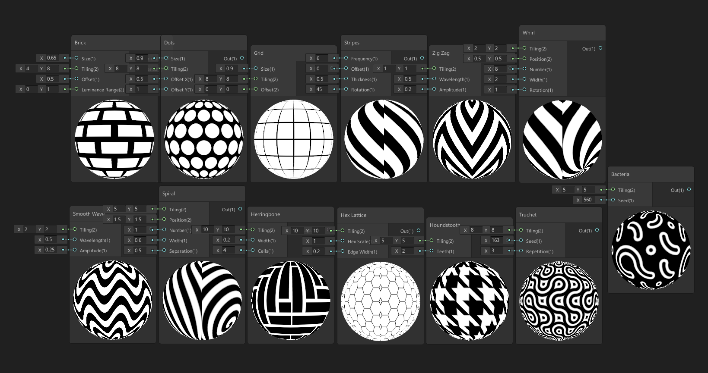
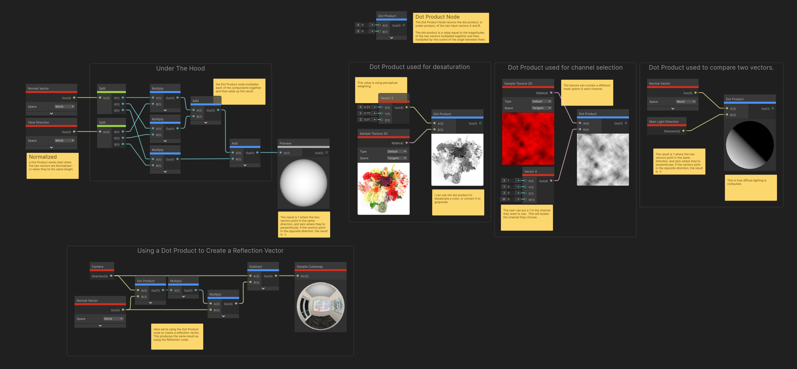
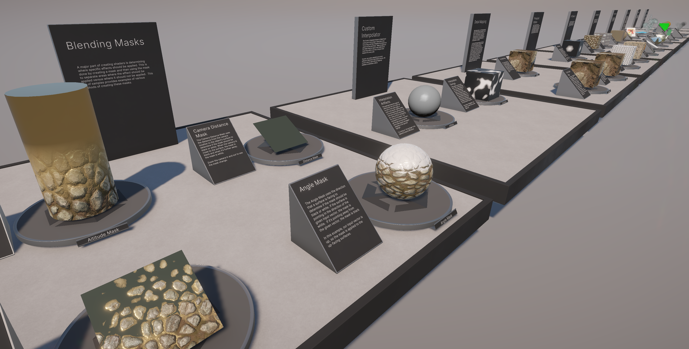

Shader Graph 示例
===============

描述
--

Shader Graph 包提供了示例资源，可通过 **Package Manager** 下载。当您导入这些示例时，团结引擎会将这些文件放置在您项目的 Asset 文件夹中。这些文件包含演示如何使用 Shader Graph 功能的示例。

添加示例
----

要将示例添加到您的项目，请转到 **Window -> Package Manager**。在可用包列表中找到并选择 **Shader Graph**。在包描述下，有可用示例列表。单击要添加的示例旁边的 **Import into Project** 按钮。

团结引擎将导入的示例放置在项目的 Asset 文件夹下，位于 **Assets -> Samples -> Shader Graph -> [版本号] -> [示例名称]** 下。本例显示了以下示例**程序化图案**。

可用示例
----

以下示例当前可用于 Shader Graph。

| 程序化图案 Procedural Patterns |
| --- |
|  |
| 这组资源展示了 Shader Graph 可能使用的各种程序技术。可以在项目中使用或编辑这些资源，创建其他程序化图案。这里的图案分别是：Bacteria、Brick, Dots、Grid、Herringbone、Hex Lattice、Houndstooth、Smooth Wave、Spiral、Stripes、Truchet、Whirl、Zig Zag。 |

| 节点参考 Node Reference |
| --- |
|  |
| 这组 Shader Graph 资源为 Shader Graph 节点库中可用的节点提供参考资料。每个图表包含对特定节点的描述、该节点的使用示例以及一些有用的提示。部分示例资源还详细展示了节点的数学运算。您可以结合这些示例和文档，深入了解各个节点的行为。 |

| [功能示例](Shader-Graph-Sample-Feature-Examples.md) |
| --- |
|  |
| 此集合包含 30 多个 Shader Graph 文件，每个文件演示一种特定的着色器技术，如角度混合、三平面投影、视差贴图和自定义光照等。尽管您不会直接将这些着色器应用于项目中，但可以通过这些示例快速学习和理解不同技术，并将它们复现到自己的作品中。每个文件内含解释着色器功能的注释，且大多数着色器将核心功能集成在易于复制粘贴的子图表中。此外，示例还附有详细的文档来帮助您理解每个示例的细节。

| [生产级着色器](Shader-Graph-Sample-Production-Ready.md) |
| --- |
|  |
| Shader Graph 的生产级着色器（Production Ready Shaders）示例是一组可直接使用或按需修改的 Shader Graph 着色器资源。您可以分解它们进行学习，或直接将其导入项目中即用。此示例包含 HDRP 和 URP Lit 着色器的 Shader Graph 版本，还提供了逐步教程，教您如何结合多个着色器创建一个森林溪流环境。 |