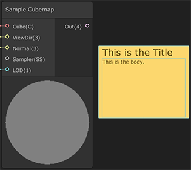

即时贴
===

**即时贴 / 便签（Sticky Notes）** 是图形视图中的对象，可用于添加文字内容，相当于代码中的注释。便签由标题和正文组成，您可以在图中创建任意数量的即时贴，并将它们用于多种用途，例如：

* 描述图中某部分的工作原理。
* 为自己或与他人协作的项目留下备注。
* 作为待办事项清单，记录需要稍后完成的任务。

使用即时贴
-----

要创建即时贴，请右键单击图形视图中的空白区域，然后在上下文菜单中单击 **Create Sticky Note**。然后，您可以自定义内容并将其添加到新的即时贴中。您可以在两个文本区域中书写：

* **Title**：即时贴顶部的文本区域是标题。您可以使用它来简明地描述即时贴包含的信息。
* **Body**：标题区域下方较大的文本区域是正文。您可以在这里写下笔记的全部内容。

### 编辑文本

要编辑即时贴上的文本，请在文本区域上双击。这也会选择整个文本区域，因此请确保在编辑文本之前移动光标。

### 移动和调整大小

您可以将即时贴移动到图形上的任何位置。您还可以单击并拖动以手动调整即时贴大小，或让即时贴自动调整大小以适应内容。有关如何使即时贴自行调整大小的信息，请参阅下方[上下文菜单](#上下文菜单)中的 **Fit to Text** 。

### 复制

使用以下键盘快捷键来剪切、复制、粘贴和复制即时贴。
* **复制**：Ctrl\+C
* **剪切**：Ctrl\+X
* **粘贴**：Ctrl\+V
* **复制**：Ctrl\+D

### 上下文菜单

要打开即时贴的上下文菜单，请右键单击即时贴上的任意位置。上下文菜单中的选项如下。

| **选项** | **描述** |
| --- | --- |
| **Dark Theme/Light Theme** | 在浅色主题和深色主题之间切换即时贴的颜色主题。 |
| **Text Size** | 将文本区域中的字体大小调整为以下点值。 |
| Small | 标题：20，正文：11 |
| Medium | 标题：40，正文：24 |
| Large | 标题：60，正文：36 |
| Huge | 标题：80，正文：56 |
| **Fit To Text** | 调整即时贴的大小，使其精确地适合文本区域。如果您的标题超过一行，团结引擎会调整即时贴的大小，使标题文本适合一行。 |
| **Delete** | 删除您选择的即时贴。 |
| **Group Selection** | 将您选择的所有即时贴放在一个组中。 |
| **Ungroup Selection** | 从组中删除选择的所有即时贴。 |
