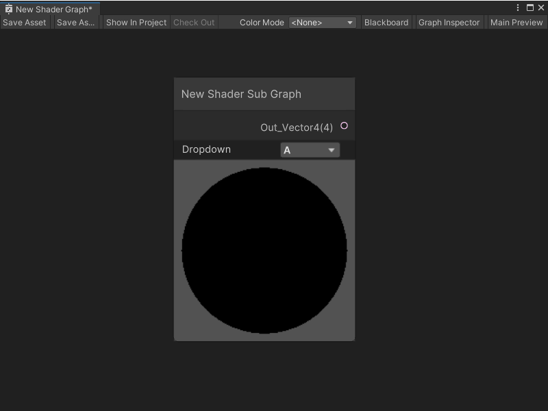
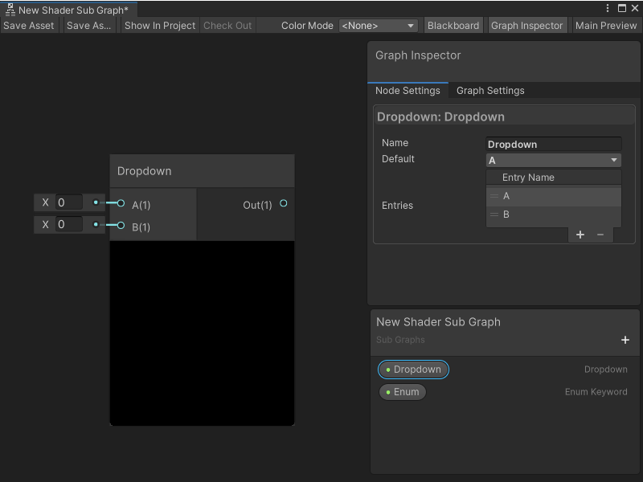
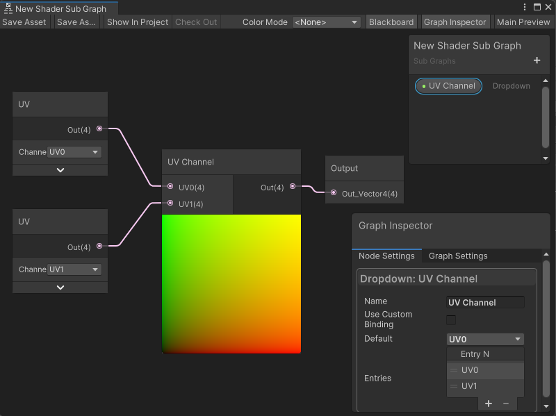

**Subgraph Dropdown 节点**
======================

描述
---

Subgraph Dropdown 节点是一个下拉属性的节点表示形式。它允许你在父 Shader Graph 中的 Subgraph 节点上创建一个自定义的下拉菜单。你可以指定在下拉菜单中出现的选项数量及其名称。

在你创建一个 Dropdown 属性并将 Dropdown 节点添加到 Subgraph 后，任何父 Shader Graph 中的 Subgraph 节点都会显示带有下拉控制：

 创建节点菜单分类
-------------------------------------------------------

Subgraph Dropdown 节点无法通过创建节点菜单访问。

要向 Subgraph 添加 Subgraph Dropdown 节点：

1. 在 Shader Graph 窗口中，打开一个 Subgraph。
2. 在 Blackboard 中，选择 **Add** (+) 并选择 **Dropdown**。
3. 为你的新 Dropdown 属性输入一个名称，然后按回车。
4. 选择你的 Dropdown 属性，并将其拖到图形上，创建一个新的 Subgraph Dropdown 节点。
5. 在图形中选择新创建的 Dropdown 节点，或者在 Blackboard 中选择 Dropdown 属性，打开 Graph Inspector。
6. 选择 **Node Settings** 选项卡。
7. 在 **Entries** 表格中，选择 **Add to the list** (+) 添加一个新的选项到下拉菜单。每个条目会为你的节点添加一个对应的输入端口。要删除一个条目，选择其句柄并选择 **Remove selection from the list** (-)。
8. （可选）在 **Default** 列表中，选择你希望 Shader Graph 在属性中选择的默认条目。

 兼容性
-------------------------------

Subgraph Dropdown 节点在以下渲染管线中受支持：

| **内置渲染管线** | **通用渲染管线（URP）** | **高清渲染管线（HDRP）** |
| --- | --- | --- |
| 是 | 是 | 是 |

 端口
-----------------

> [!NOTE]
> Subgraph Dropdown 节点的输入端口数量及其名称直接对应于你在 Graph Inspector 的 **Node Settings** 选项卡中指定的设置。该节点始终有一个输出端口。

Subgraph Dropdown 节点的输入端口始终具有 **DynamicVector** 类型。这意味着你可以将任何输出 float、Vector 2、Vector 3、Vector 4 或 Boolean 值的节点连接到输入端口。有关更多信息，请参阅 [动态数据类型](Data-Types.md)。

它有一个输出端口：

| **名称** | **类型** | **描述** |
| --- | --- | --- |
| Out | DynamicVector | 从父 Shader Graph 的 Subgraph 节点中选择的下拉菜单选项。此值也可以是 Graph Inspector 的 **Node Settings** 选项卡中指定的 **Default**。 |

 示例图使用
-------------------------------------------

在以下示例中，Subgraph Dropdown 节点更改它传递给 Subgraph 输出节点的 UV 通道。父图中的 Subgraph 节点上的选择决定了 Subgraph 输出 **UV1** 还是 **UV0**。如果 Subgraph 在多个 Shader Graph 中使用，Subgraph Dropdown 节点可以在不更改 Subgraph 的情况下更改 UV 通道输出：

 相关节点
-------------------------------

以下节点与 Subgraph Dropdown 节点相关或相似：

* [Subgraph 节点](Sub-graph-Node.md)