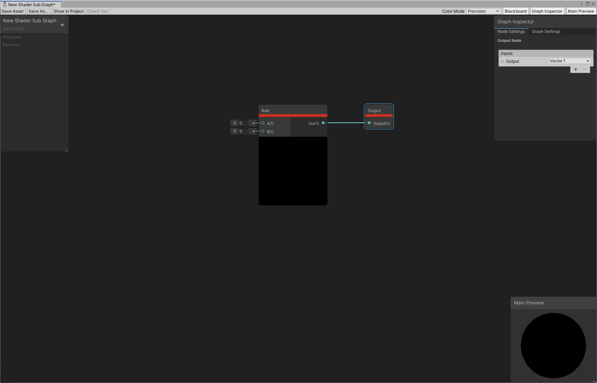

子图
===

描述
--

**子图（Sub Graph）** 是一种特殊类型的 Shader Graph，可从其他图形内部引用。在一个图形中或多个图形之间多次执行相同的操作时，这非常有用。子图在 3 个方面不同于 Shader Graph：

* 子图 [Blackboard](Blackboard.md) 中的[属性](Property-Types.md) 定义了当[子图节点](Sub-graph-Node.md)在其他图中引用时的输入[端口](Port.md)。
* 子图具有其自身的资源类型。如需了解更多信息，包括如何创建新的子图的操作，请参阅[子图资源](Sub-graph-Asset.md)。
* 子图没有[主栈](Master-Stack.md)。但是，有一个称为 **Output** 的[节点](Node.md)。

有关子图组件的信息，请参见[子图资源](Sub-graph-Asset.md)。

Output 节点
---------

当子图在另一个图形中被引用时，Output 节点定义 [Sub Graph 节点](Sub-graph-Node.md)的输出端口。要添加和删除端口，单击 Sub Graph Output 节点，使用 [Graph Inspector](Internal-Inspector.md) 的 **Node Settings** 选项卡中的 [Custom Port Menu](Custom-Port-Menu.md) 进行操作。

用于子图的预览由其 Output 节点的第一个端口决定。第一个端口有效的[数据类型](Data-Types.md)是 `Float`、`Vector 2`、`Vector 3`、`Vector 4`、`Matrix2`、`Matrix3`、`Matrix4` 和 `Boolean`。任何其他数据类型在预览着色器和子图中都会产生错误。

子图和着色器阶段
---------

如果子图中的节点指定了一个着色器阶段（例如，[Sample Texture 2D](Sample-Texture-2D-Node.md) 节点指定了**片元**着色器阶段），编辑器会将整个子图锁定在该阶段。您无法将指定其他着色器阶段的节点连接到子图的输出节点，并且编辑器会将引用该图的所有子图节点锁定在此着色器阶段。

从 10.3 开始，子图的 Texture 和 SamplerState 类型输入和输出受益于改进的数据结构。详细解释见[自定义函数节点](Custom-Function-Node.md)。

子图和关键字
-------

子图中的 [Blackboard](Blackboard.md) 上定义的[关键字](Keywords.md)行为类似于常规 Shader Graph 中的行为。将 Sub Graph 节点添加到 Shader Graph 中时，团结引擎还会在 Shader Graph 中定义该子图中的所有关键字，以便子图按预期工作。

要在 Shader Graph 中使用 Sub Graph 关键字，或在材质检视面板中显示该关键字，请将其从子图复制到 Shader Graph 的 Blackboard 上。

