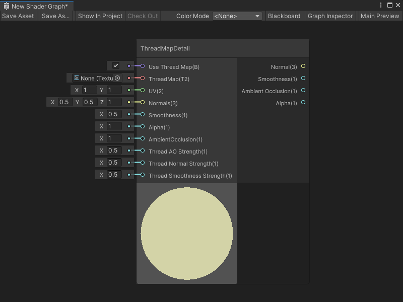

ThreadMapDetail 节点
====================

描述
---

ThreadMapDetail 节点为布料材质添加可平铺的线纹图细节信息。该节点输出的线纹图可应用于布料材质。

> [!NOTE]
> 此节点为子图节点：它表示一个子图，而不是直接表示着色器代码。在任意 Shader Graph 中双击该节点可以查看其子图。

线纹图是一种具有 4 个通道的纹理。与细节图相似，线纹图包含环境光遮蔽、法线 x 轴、法线 y 轴和光滑度的信息。

有关细节图的更多信息，请参阅团结引擎用户手册中的 [辅助贴图（细节贴图）和细节遮罩](https://docs.unity.cn/cn/tuanjiemanual/Manual/StandardShaderMaterialParameterDetail.html)。

 创建节点菜单分类
-------------------------------------------------------

ThreadMapDetail 节点在创建节点菜单中位于 **Utility -> High Definition Render Pipeline -> Fabric** 分类下。

 兼容性
-------------------------------

该节点支持以下渲染管线：

| **内置渲染管线** | **通用渲染管线（URP）** | **高清渲染管线（HDRP）** |
| --- | --- | --- |
| 否 | 否 | 是 |

有关 HDRP 的更多信息，请参阅 [HDRP 包文档](https://docs.unity.cn/cn/Packages-cn/com.unity.render-pipelines.high-definition@latest)。

此节点还可以连接到任一上下文中的 Block 节点。有关 Block 节点和上下文的更多信息，请参阅 [主栈（Master Stack）](Master-Stack.md)。

 输入
-----------------

该节点具有以下输入端口：

| **名称** | **类型** | **绑定** | **描述** |
| --- | --- | --- | --- |
| **Use Thread Map** | Boolean | 无 | 使用该端口的默认输入来启用或禁用 ThreadMapDetail 节点。你也可以连接输出布尔值的节点来选择何时启用或禁用线纹图。 |
| **ThreadMap** | Texture 2D | 无 | 包含布料线纹图细节信息的纹理。纹理应包含 4 个通道：   · R - 环境光遮蔽   · G - 法线 Y 轴   · B - 光滑度   · A - 法线 X 轴|
| **UV** | Vector 2 | UV | ThreadMapDetail 节点用于在几何体上映射 ThreadMap 纹理的 UV 坐标。 |
| **Normals** | Vector 3 | 无 | Shader Graph 应用于几何体的基础法线图，在应用线纹图之前使用。 |
| **Smoothness** | Float | 无 | Shader Graph 应用于几何体的基础光滑度值，在应用线纹图之前使用。 |
| **Alpha** | Float | 无 | Shader Graph 应用于几何体的基础 Alpha 值，在应用线纹图之前使用。 |
| **Ambient Occlusion** | Float | 无 | Shader Graph 应用于几何体的基础环境光遮蔽值，在应用线纹图之前使用。 |
| **Thread AO Strength** | Float | 无 | 指定 `0` 或 `1` 的值来确定 **ThreadMap** 的环境光遮蔽对最终着色器结果的影响：   · 值为 `0` 时，**ThreadMap** 的环境光遮蔽对着色器最终输出无影响。   · 值为 `1` 时，Shader Graph 将基础 **Ambient Occlusion** 值乘以 **ThreadMap** 指定的环境光遮蔽值以确定着色器的最终输出。|
| **Thread Normal Strength** | Float | 无 | 指定 `0` 或 `1` 的值来确定 **ThreadMap** 的法线对最终着色器结果的影响：   · 值为 `0` 时，**ThreadMap** 的法线对着色器最终输出无影响。   · 值为 `1` 时，Shader Graph 将基础 **Normals** 值与 **ThreadMap** 指定的法线进行混合以确定着色器的最终输出。|
| **Thread Smoothness Strength** | Float | 无 | 指定 `0` 或 `1` 的值来确定 **ThreadMap** 的光滑度对最终着色器结果的影响：   · 值为 `0` 时，**ThreadMap** 的光滑度值对着色器最终输出无影响。   · 值为 `1` 时，Shader Graph 将 **ThreadMap** 指定的光滑度值加到基础 **Smoothness** 值上以确定着色器的最终输出。在此计算中，Shader Graph 将 **ThreadMap** 的光滑度值从 (0,1) 重映射到 (-1,1)。|

 输出
-------------------

该节点具有以下输出端口：

| **名称** | **类型** | **描述** |
| --- | --- | --- |
| **Normal** | Vector 3 | 线纹图的最终法线输出。 |
| **Smoothness** | Float | 线纹图的最终光滑度输出。 |
| **Ambient Occlusion** | Float | 线纹图的最终环境光遮蔽输出。 |
| **Alpha** | Float | 线纹图的最终 Alpha 输出。Shader Graph 通过将输入 **Alpha** 值乘以 **Thread AO Strength** 值来计算此 Alpha 值。 |

 示例图使用
-------------------------------------------

有关 ThreadMapDetail 节点的示例用法，请参阅 HDRP 的任一 Fabric 着色器。

要查看这些 Shader Graph：

1.  创建一个新材质，并按照团结引擎用户手册中 [创建材质资产并分配着色器](https://docs.unity.cn/cn/tuanjiemanual/Manual/materials-introduction.html) 的描述，为其分配 **HDRP -> Fabric -> Silk** 或 **HDRP -> Fabric -> CottonWool** 着色器。
    
2.  在 **Shader** 下拉列表旁选择 **Edit**。
    
您选择的 Fabric 着色器图将打开。你可以查看 ThreadMapDetail 节点、其子图以及创建 HDRP 布料着色器的其他节点。