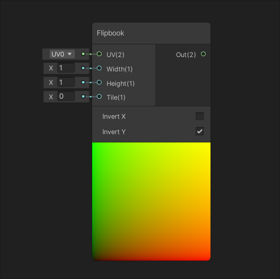
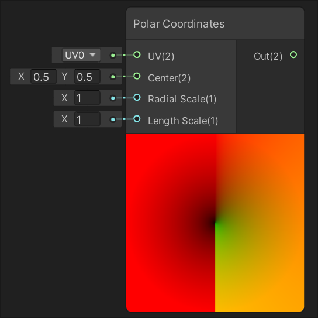
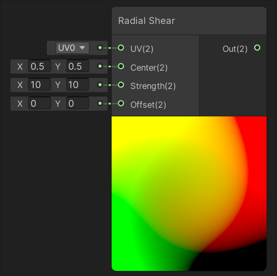
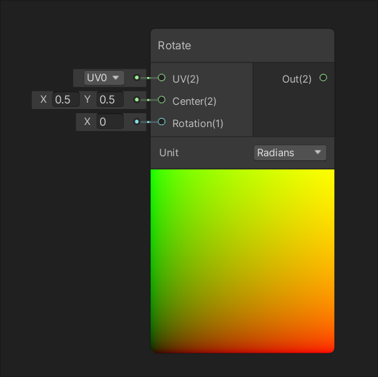
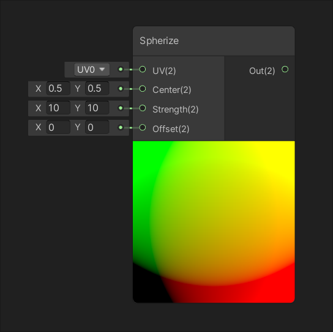
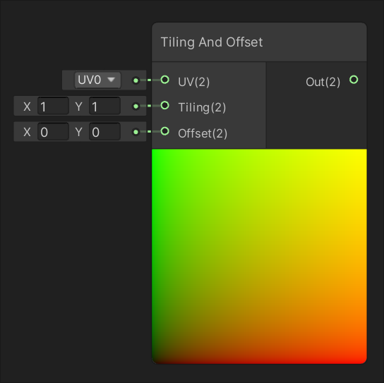
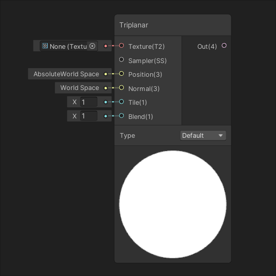
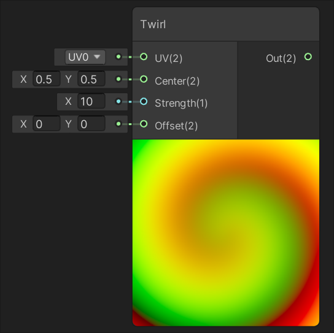
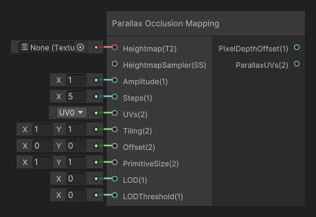
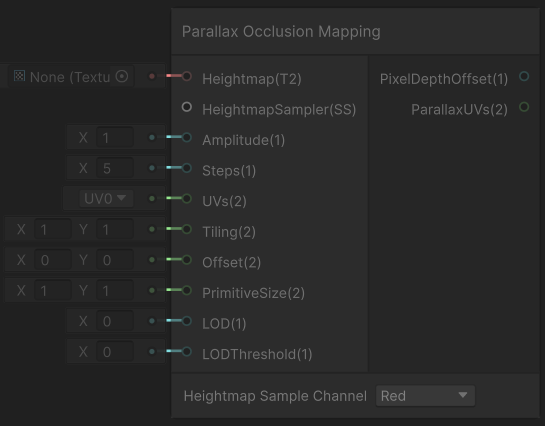

UV 节点
========

| [Flipbook](Flipbook-Node.md) | [Polar Coordinates](Polar-Coordinates-Node.md) |
| --- | --- |
|  |  |
| 使用向输入 In 提供的 UV 创建翻页或纹理帧动画。 | 将输入 UV 的值转换为极坐标。 |
| [**Radial Shear**](Radial-Shear-Node.md) | [**Rotate**](Rotate-Node.md) |
|  |  |
| 将类似于波的径向剪切变形效果应用于输入 UV 的值。 | 围绕输入 Center 定义的参考点将输入 UV 的值旋转输入 Rotation 的大小。 |
| [**Spherize**](Spherize-Node.md) | [**Tiling and Offset**](Tiling-And-Offset-Node.md) |
|  |  |
| 将类似于鱼眼镜头的球形变形效果应用于输入 UV 的值。 | 分别根据输入 Tiling 和 Offset 来平铺和偏移输入 UV 的值。 |
| [**Triplanar**](Triplanar-Node.md) | [**Twirl**](Twirl-Node.md) |
|  |  |
| 一种通过在世界空间中投影来生成 UV 并对纹理进行采样的方法。 | 将类似于黑洞的旋转变形效果应用于输入 UV 的值。 |
| [**Parallax Mapping**](Parallax-Mapping-Node.md) | [**Parallax Occlusion Mapping**](Parallax-Occlusion-Mapping-Node.md) |
|  |  |
| 创建一个偏移材质UV的视差效果。| 创建一个偏移材质UV和深度的视差效果。|
| [PixelateUV](PixelateUV-Node.md)  |  |
|  |  |
| 将 UV 信息像素化，产生马赛克纹理效果。 |  |