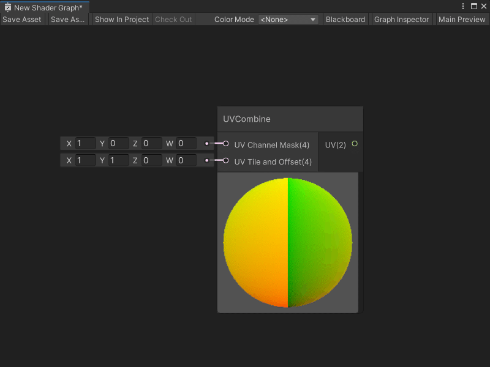

UVCombine 节点
====================

描述
---

UVCombine 节点允许你选择使用哪个 UV 通道，将着色器映射到应用中的几何体上。你还可以选择对 UV 坐标应用平铺（Tiling）和偏移（Offset）。

> [!NOTE]
> 此节点是一个子图节点：它表示一个子图，而不是直接表示着色器代码。在任意 Shader Graph 中双击该节点可以查看其子图。

 创建节点菜单分类
-------------------------------------------------------

UVCombine 节点在创建节点菜单中位于 **Utility -> High Definition Render Pipeline** 分类下。

 兼容性
-------------------------------

该节点支持以下渲染管线：

| **内置渲染管线** | **通用渲染管线（URP）** | **高清渲染管线（HDRP）** |
| --- | --- | --- |
| 否 | 否 | 是 |

有关 HDRP 的更多信息，请参阅 [HDRP 包文档](https://docs.unity.cn/cn/Packages-cn/com.unity.render-pipelines.high-definition@latest)。

该节点还可以连接到任一上下文中的 Block 节点。有关 Block 节点和上下文的更多信息，请参阅 [主栈（Master Stack）](Master-Stack.md)。

 输入
-----------------

该节点具有以下输入端口：

| **名称** | **类型** | **描述** |
| --- | --- | --- |
| **UV Channel Mask** | Vector 4 | 选择你要用于 UV 坐标的 UV 通道，通过在端口对应的默认输入上输入 `1` 来进行选择： · **X**：UV 通道 0 · **Y**：UV 通道 1 · **Z**：UV 通道 2 · **W**：UV 通道 3 将所有其他默认输入设置为 `0`。你也可以连接一个输出 Vector 4 的节点。 |
| **UV Tile and Offset** | Vector 4 | 使用端口的默认输入来指定你希望应用到着色器 UV 坐标的偏移或平铺量： · 使用 **X** 和 **Y** 来指定平铺。 · 使用 **W** 和 **Z** 来指定偏移。 你也可以连接一个输出 Vector 4 的节点。 |

 输出
-------------------

该节点具有一个输出端口：

| **名称** | **类型** | **绑定** | **描述** |
| --- | --- | --- | --- |
| **UV** | Vector 2 | UV | 选择 UV 通道后的最终 UV 输出，若已指定，也会包含平铺或偏移。 |

 示例图使用
-------------------------------------------

有关 UVCombine 节点的示例用法，请参阅 HDRP 的任一 Fabric 着色器。

要查看这些 Shader Graph：

1. 创建一个新材质，并按照团结引擎用户手册中 [创建材质资产并分配着色器](https://docs.unity.cn/cn/tuanjiemanual/Manual/materials-introduction.html) 的描述，为其分配 **HDRP -> Fabric -> Silk** 或 **HDRP -> Fabric -> CottonWool** 着色器。
    
2. 在 **Shader** 下拉列表旁选择 **Edit**。
    

您选择的 Fabric Shader Graph 将打开。您可以查看 UVCombine 节点、其子图以及创建 HDRP Fabric 着色器的其他节点。