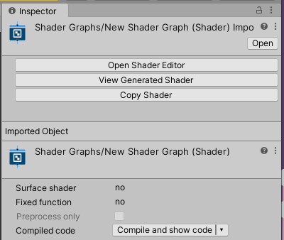
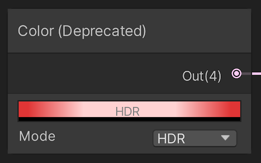
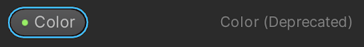
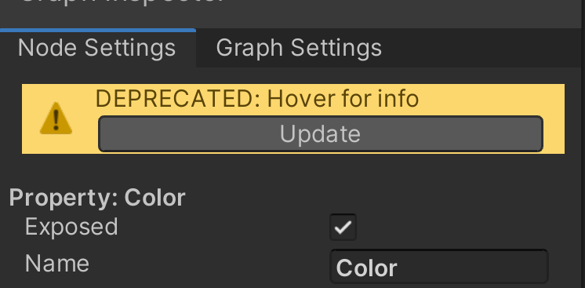

升级到 Shader Graph 10\.0\.x 版本
============================


重命名 Vector 1 属性和浮点精度
--------------------

Shader Graph 已将 **Vector 1** 属性在 Vector 1 节点和公开的参数列表中重命名为 **Float**。**Float** 精度也被重命名为 **Single**。行为完全相同，只是名称发生了变化。


重命名的 Sample Cubemap 节点
----------------------


Shader Graph 已将之前的 Sample Cubemap 节点重命名为 [Sample Reflected Cubemap 节点](Sample-Reflected-Cubemap-Node.md)，并添加了一个使用世界空间方向的新 [Sample Cubemap 节点](Sample-Cubemap-Node.md)。


主栈图形输出
------

Shader Graph 移除了主节点并引入了更加灵活的[主栈](Master-Stack.md)解决方案，用于定义 10\.0 中的图形输出。您仍然可以打开在以前版本中创建的所有图形，因为 Shader Graph 会自动将其升级。此页面描述了预期行为，并说明了您何时可能需要执行手动升级步骤。


## 从主节点自动升级 <a name="AutomaticUpgrade"></a>


### 将一个主节点升级到主栈


如果您的图形只有一个主节点，则如本节所述，Shader Graph 会自动将来自该主节点的所有数据升级到主栈输出。


Shader Graph 自动将正确的[目标](Graph-Target.md)添加到 [**Graph Inspector**](Internal-Inspector.md) 的 [**Graph Settings**](Graph-Settings-Tab.md) 选项卡。它还将描述主节点表面选项的主节点设置菜单（齿轮图标）中的所有设置复制到 **Target Settings**。


然后，Shader Graph 会将主节点上每个端口的 [Block](Block-Node.md) 节点添加到主栈。它会将连接到主节点端口的任何节点连接到相应的 Block 节点。此外，Shader Graph 会将您在主节点端口的默认值输入中输入的任何值复制到相应的 Block 节点。


完成升级过程之后，最终的着色器在外观上是相同的。


### 将多个主节点升级到主栈


如果您的图形有多个主节点，Shader Graph 会应用上述流程，自动将一个主节点升级到当前选定的活动主节点。


当您升级到主栈格式时，Shader Graph 会从您的图形中删除所有不活动的主节点，您可能会丢失这些数据。如果您计划升级具有多个主节点的图形，最好记录一下非活动主节点的端口、连接的节点以及设置菜单（齿轮图标）中的任何非默认设置。


升级后，您可以添加任何缺失的所需 Block 节点，并将这些节点重新连接到主栈。您还需要通过 **Graph Inspector -> Graph Settings 选项卡 -> 设置菜单（齿轮图标）**，在相应的 Target Setting 中手动输入非活动主节点的设置。


### 将跨管线主节点升级到主栈


如果您的图形包含与[通用渲染管线](https://docs.unity.cn/cn/Packages-cn/com.unity.render-pipelines.universal@latest) (URP) 和[高清渲染管线](https://docs.unity.cn/cn/Packages-cn/com.unity.render-pipelines.high-definition@latest) (HDRP) 两者兼容的 PBR 或无光照主节点，Shader Graph 会根据项目中当前可用的渲染管线自动将它们升级到主栈。使用主栈从一个渲染管线切换到另一个渲染管线时，您必须重新导入 Shader Graph 资源以更新项目中任何材质的材质检视面板。


在 URP 中，您现在可以在 URP Lit Target 中找到所有 PBR 主节点设置。无光照主节点设置位于 URP Unlit Target 中。这些设置全都相同，最终着色器应该和升级前相同。


在 HDRP 中，来自 PBR 和无光照主节点的设置与 HDRP Lit 和 Unlit Targets 不同。因此，当您将 PBR 或无光照主节点升级到 HDRP Lit 和无光照主栈时，可能会出现意外行为。最终着色器可能与升级前不同。发生这种情况时，您可以使用 **Bug Reporter** 提交升级相关问题，但请注意，某些升级路径没有即时自动化解决方案，需要手动调整。


### "View Generated Shader" 已移动


以前，您可以右键单击主节点以调出上下文菜单，然后选择 **View Generated Shader** 预览生成的着色器。现在在 10\.0 中，您必须使用 Inspector，然后在 Shader Graph 资源上单击 **View Generated Shader** 按钮。





Graph Inspector 中的设置
--------------------


Shader Graph 在版本 10\.0 引入了一个内部 [Graph Inspector](Internal-Inspector.md)。Graph Inspector 是一个浮动窗口，显示与您在图形中选择的对象相关的设置。


### Graph Settings


图形范围设置现在仅在 Graph Inspector 的 **Graph Settings** 选项卡中可用。值得注意的一点是，您现在可以前往 **Graph Settings** 选项卡访问 **Precision** 开关（此前位于 Shader Graph 工具栏上）。数据没有变化，如图形 **Precision** 设置等保持不变。


在 **Graph Settings** 选项卡中，您还可以找到描述每个目标的表面选项设置（此前位于主节点齿轮菜单中）。有关 Shader Graph 如何自动升级此数据的更多信息，请参阅上述[从主节点自动升级](#AutomaticUpgrade)。


### 属性设置


此前位于 Blackboard 折叠标签中的属性设置现在可在 Graph Inspector 中使用。您现在可以从 Blackboard 选择多个属性并同时编辑它们。数据没有变化，您对图形属性所做的所有设置都保持不变。


### 每节点设置


此前通过打开设置（齿轮图标）子菜单进行管理的所有每节点设置现在都可以通过 Graph Inspector 访问。数据没有变化，您之前在节点上设置的所有设置（例如精度设置和自定义函数节点设置）都保持不变。


主节点上定义表面选项的任何设置现在都位于 Graph Inspector 的 Graph Settings 选项卡中。有关更多信息，请参阅上述[从主节点自动升级](#AutomaticUpgrade)。


自定义函数节点和 Shader Graph 预览
------------------------

为避免在自定义函数节点的预览着色器编译中出现错误，您可能需要使用关键字进行图形内预览渲染。


如果您的任何带有自定义 Shader Graph 预览代码的自定义函数节点使用了 `#if SHADERGRAPH_PREVIEW`，您需要将其升级为 `# ifdef` 声明，如下所示：


```
# ifdef SHADERGRAPH_PREVIEW
    Out = 1;
# else
    Out = MainLight;
# endif

```
弃用的节点和属性行为
----------


此前一些节点和属性（例如 [Color 节点](Color-Node.md)）没有按预期运行，但现在可以在 Shader Graph 10\.0 版中正常工作。利用不正确行为的旧图形仍与以前相同，您可以选择单独升级任何已弃用的节点和属性。如果未在 [Shader Graph Preferences](Shader-Graph-Preferences.md) 中启用 **Allow Deprecated Behaviors**，新创建的节点和属性使用最新版本的节点和属性行为。


对于已弃用的节点，**(Deprecated)** 将出现在主图形视图中的节点标题之后。





对于已弃用的属性，**(Deprecated)** 将出现在 [Blackboard](Blackboard.md) 中的属性名称之后。





当您选择已弃用的节点或属性时，[Internal Inspector](Internal-Inspector.md) 中会出现警告，并带有一个 **Update** 按钮，可用于对选择内容进行升级。您可以使用撤消/重做以逆转此升级过程。





如果您在 [Shader Graph Preferences](Shader-Graph-Preferences.md) 中启用 **Allow Deprecated Behaviors**，Shader Graph 显示已弃用的节点或属性的版本，但不显示任何警告，即使 **Update** 按钮出现。您还可以使用 Blackboard 或 Searcher 创建已弃用的节点和属性。
