Utility 节点
======

| [Local Variable Register](Local-Variable-Register-Node.md) | [Get Local Variable](Get-Local-Variable-Node.md) |
| -- | -- |
|  |  |
| 创建一个局部变量。 | 访问对应的局部变量。 |
| [**Preview**](Preview-Node.md) | [**Sub-Graph**](Sub-graph-Node.md) |
| 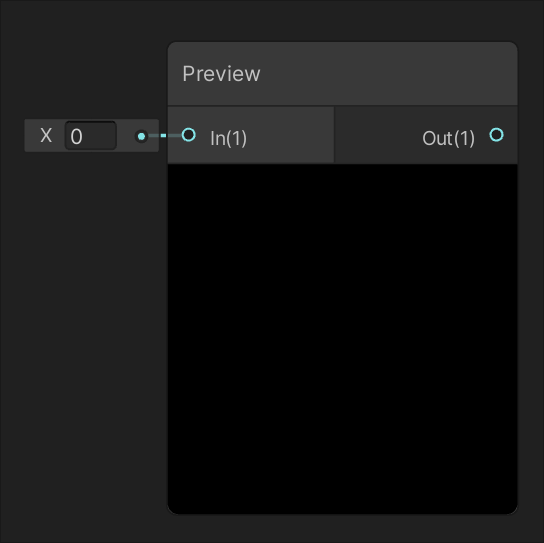 | 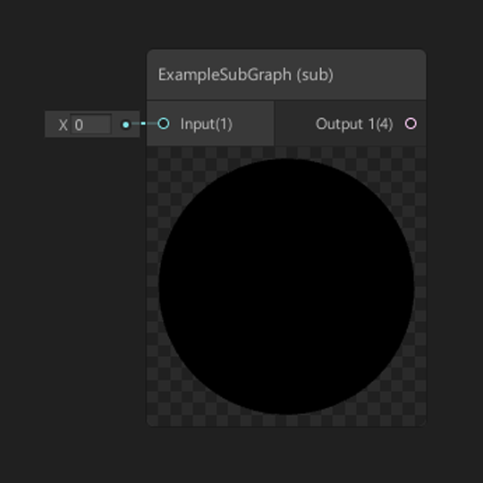 |
| 提供预览窗口并传递输入值而无需修改。 | 提供对子图形资源的引用。 |

| [For Loop](For-Loop-Node.md) | 
|--|
| 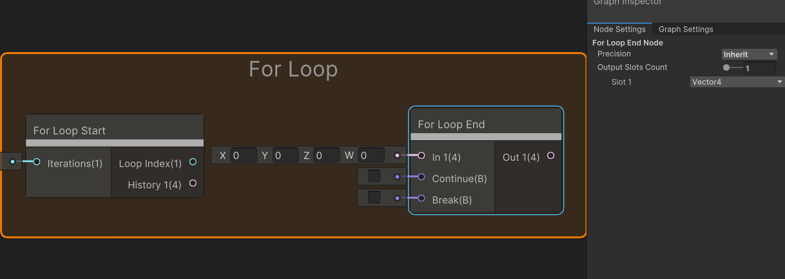 | 
| 进行迭代计算。 |

逻辑
--

| [All](All-Node.md) | [And](And-Node.md) |
| --- | --- |
| 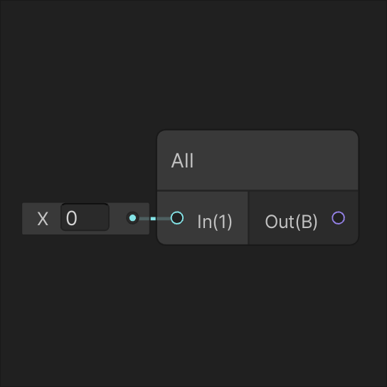 | 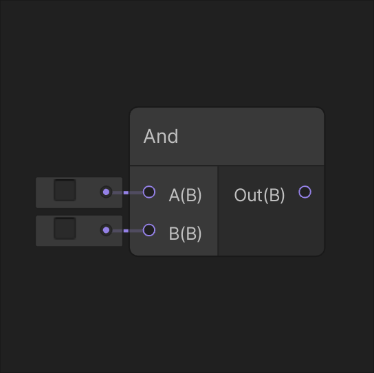 |
| 如果输入 In 的所有分量都不为零，则返回 true。 | 如果输入 A 和 B 均为 true，则返回 true。 |
| [**Any**](Any-Node.md) | [**Branch**](Branch-Node.md) |
| 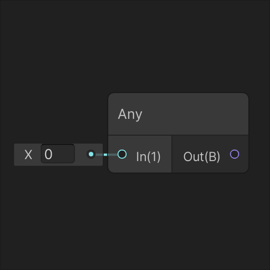 | 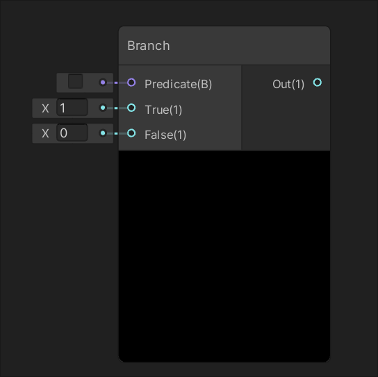 |
| 如果输入 In 的任何分量不为零，则返回 true。 | 为着色器提供动态分支。 |
| [**Comparison**](Comparison-Node.md) | [**Is Infinite**](Is-Infinite-Node.md) |
| 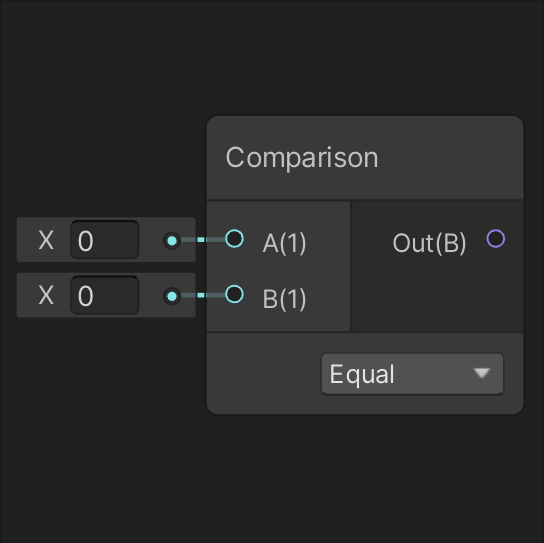 | 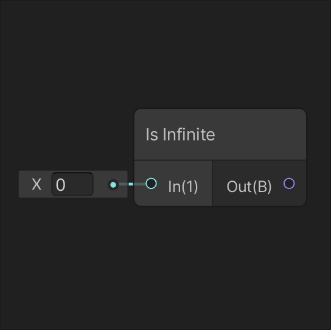 |
| 根据下拉选单上选择的条件比较两个输入值 A 和 B。 | 如果输入 In 的任何分量是无限值，则返回 true。 |
| [**Is NaN**](Is-NaN-Node.md) | [**Nand**](Nand-Node.md) |
| 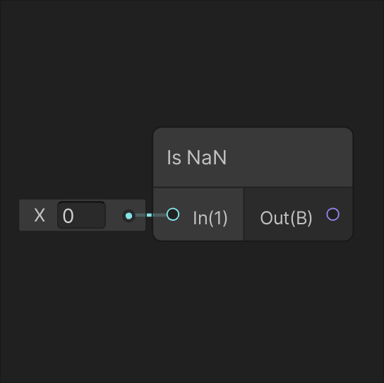 | 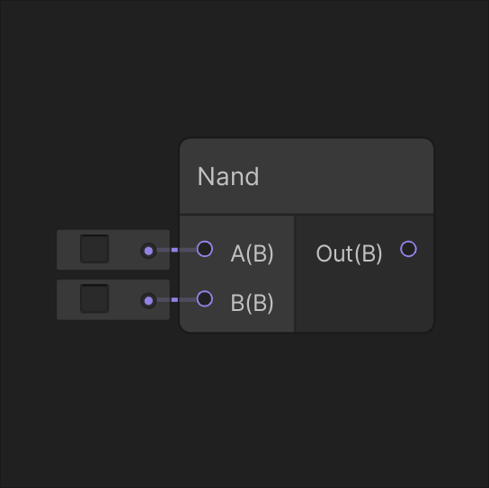 |
| 如果输入 In 的任何分量为非数值 (NaN)，则返回 true。 | 如果输入 A 和 B 均为 false，则返回 true。 |
| [**Not**](Not-Node.md) | [**Or**](Or-Node.md) |
| 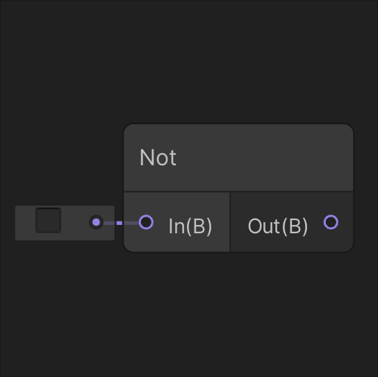 | 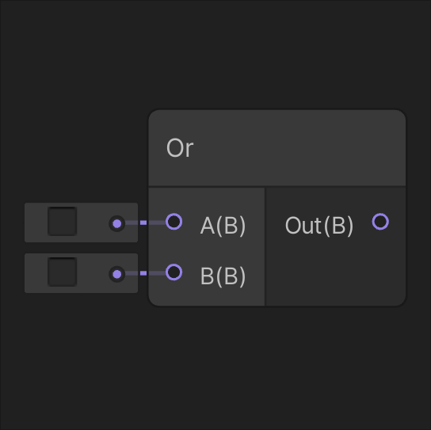 |
| 返回输入 In 的取反。如果 In 为 true，则输出为 false。否则返回 true。 | 如果输入 A 或输入 B 为 true，则返回 true。 |
