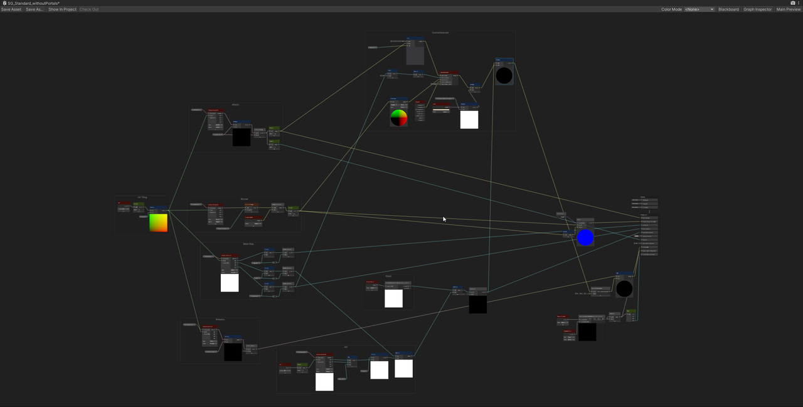
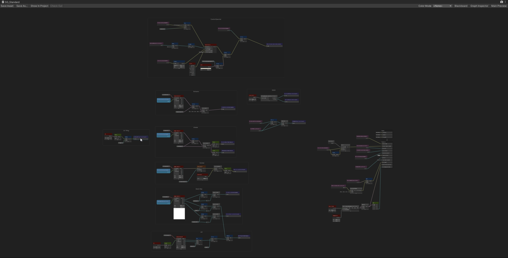
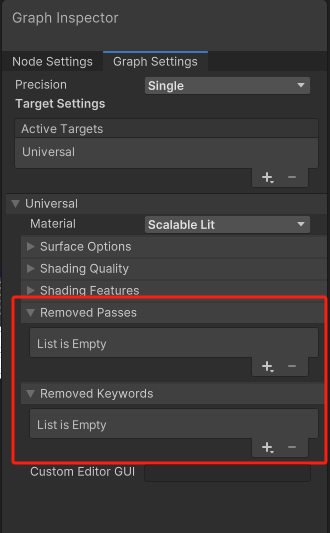
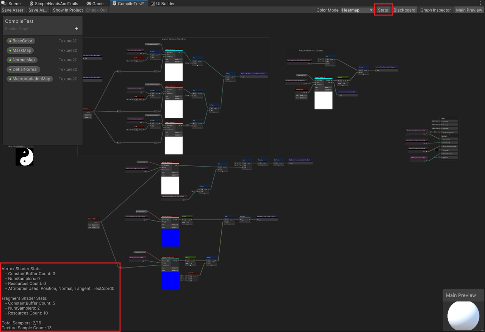
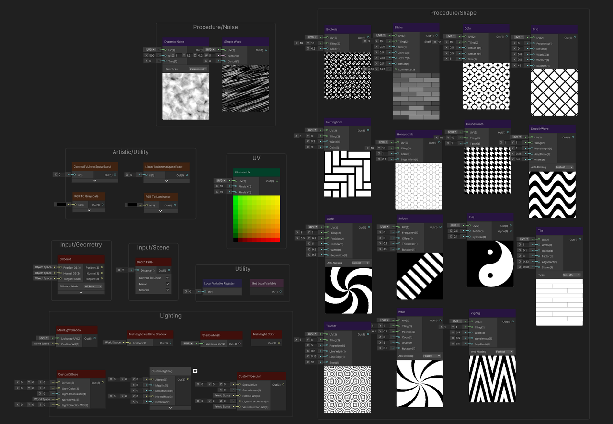
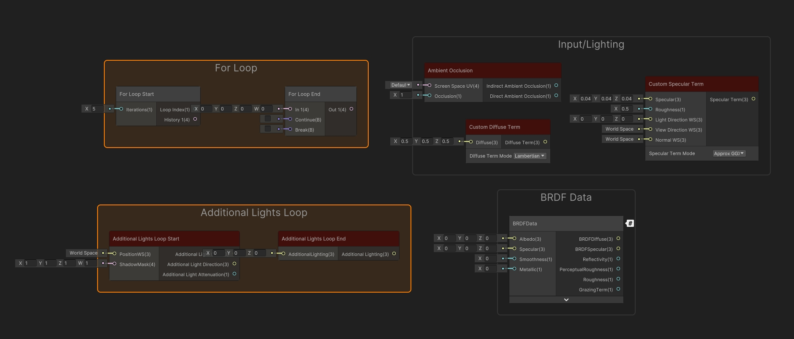
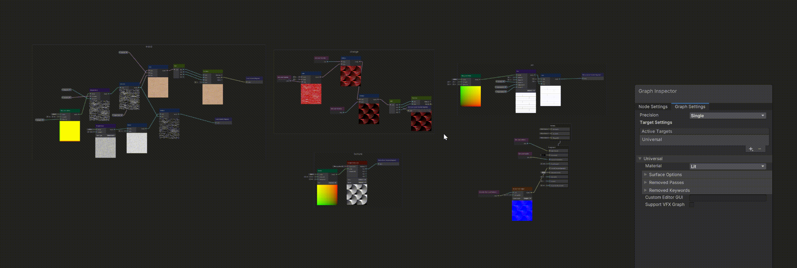
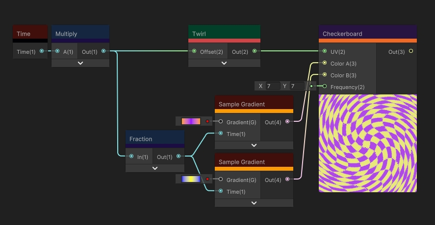

# What's new in Shader Graph

本节包含有关 Shader Graph 14 适配团结引擎的新功能、改进和已修复问题。有关更多更改的完整列表，请参阅[更改日志](https://docs.unity.cn/cn/Packages-cn/com.unity.shadergraph@latest/changelog/CHANGELOG.html)。

## 更新亮点 

Shader Graph 本次更新聚焦 功能扩展 和 使用体验提升，为开发者带来以下核心亮点：

### Local Variable（局部变量）

首次引入局部变量，在 Shader Graph 中实现模块化布局，打破原有网状编辑的局限性。开发者可以更加清晰地组织节点逻辑，显著提升了着色器的可读性与灵活性。要了解有关该功能的更多信息，请参阅 [局部变量](LocalVariable.md)、[Local Variable Register 节点](./Local-Variable-Register-Node.md) 和 [Get Local Variable 节点](./Get-Local-Variable-Node.md)页面。

Shader Graph 原有网状结构：

 

引入 Local Variable 后的模块化布局：

  

现已支持通过 Create Node Menu 搜索功能，快速获取已注册节点对应的 Get 节点。

### 渲染优化工具包
新增 Keywords 和 Passes 的自定义剔除功能，有效减少渲染性能开销，为开发者提供高效的渲染优化手段。详情请参阅 [渲染优化工具包](RenderingOptimization.md)。

### Scalable Lit 与 Fabric Shader

新增两种 Shader，目前仅支持 URP。
* [Scalable Lit](ScalableLit.md)：开发者可根据需求灵活调整渲染质量，自行选择需要用到的特性，平衡性能与视觉表现。
* [Fabric Shader](Fabric.md)：模拟棉毛、丝绸等织物，带来真实材质效果。

模拟棉毛织物：
 

模拟丝绸织物：

### Shader Stats

新增 Shader Stats 功能（Experimental），实时展示 shader 编译后的详细统计数据，为开发者提供资源使用情况和性能优化的参考依据。

### 新节点
本次更新新增了 30+ 实用节点，涵盖动态模型、光照渲染等核心领域。具体节点介绍请参考节点库中对应页面。

| 类型 | 节点 |
| -- | -- |
| Artistic/Utility | GammaToLinearSpaceExact   LinearToGammaSpaceExact   RGB to Luminance   Rgb to Grayscale |
| Input/Geometry | Billboard |
| Input/Scene | Depth Fade |
| Input/Lighting | Additional Lights Loop(URP)   Ambient Occlusion(URP)   Custom Diffuse Term   Custom Specular Term   Main Light Color   Main Light Shadow(URP)   Main Light Realtime Shadow（URP）   ShadowMask(URP)|
| Procedure/Noise | Dynamic Noise   Simple Wood |
| Procedure/Shape | Bacteria   Bricks   Dots   Grid   Herringbone   Honeycomb   Houndstooth   Smoothwave   Spiral   Stipes   Taiji   Tile   Truchet   Whirl   Zigzag |
| Sub Graphs | BRDF Data(URP) |
| Utility | Local Variable Register   Get Local Variable   For Loop |
| UV | Pixelate UV |

### 优化 LOD 预览
优化工作区预览工具，提供更直观的调试体验，便于开发者快速预览并进行整体调整。

### 优化颜色分类模式
更新默认颜色分类模式，提升节点类型识别度；
新增热力图颜色模式（Heatmap），通过颜色直观呈现节点的 GPU 性能消耗，帮助快速识别并优化着色器中的性能瓶颈。详情请参阅 [颜色模式](./Color-Modes.md)页面 。

## 已解决的问题
有关 Shader Graph 14 中已解决问题的完整列表，请参阅[更改日志](https://docs.unity.cn/cn/Packages-cn/com.unity.shadergraph@latest/changelog/CHANGELOG.html)。

## 已知问题
有关 Shader Graph 14 中已知问题的信息，请参阅 [团结引擎 release note](https://unity.cn/editor1-4-0/release-note)。